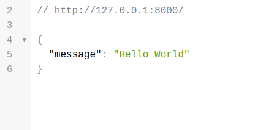
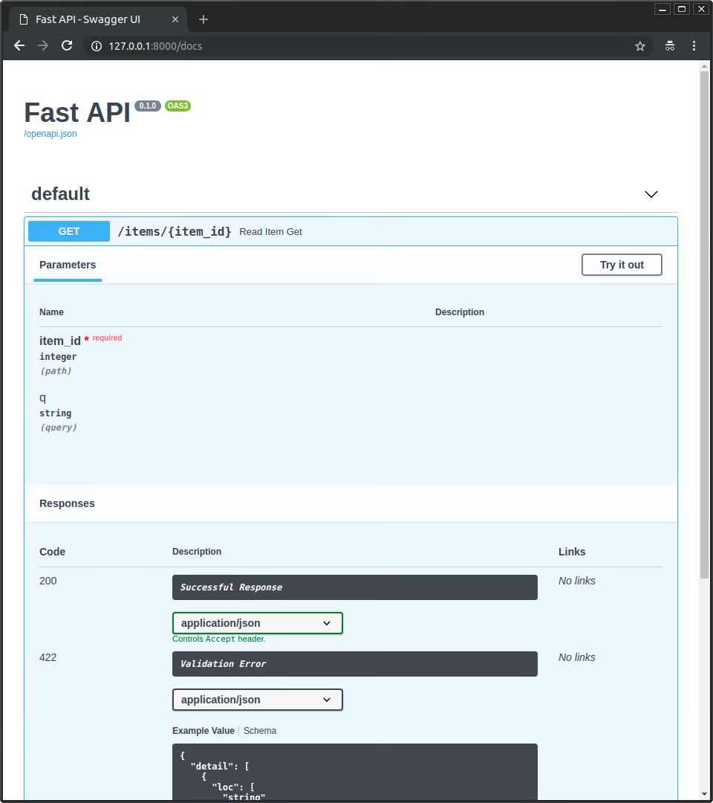
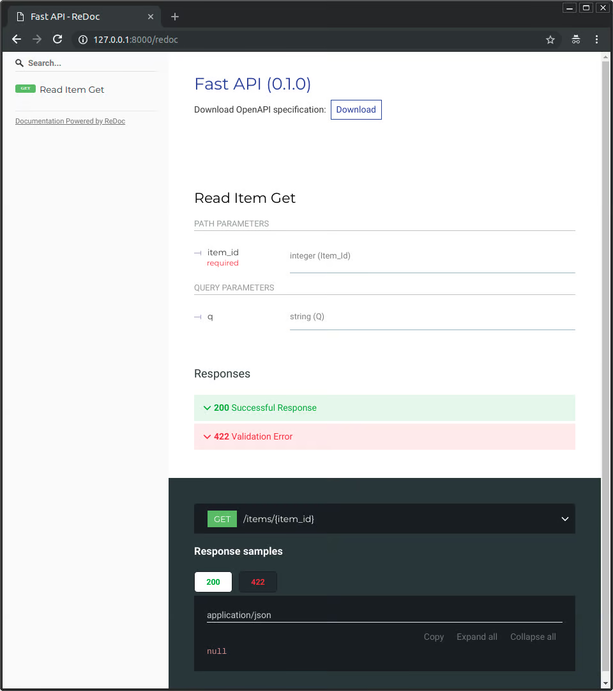

---

### `(ENG)`  What Is FastAPI?
#### FastAPI is a modern, high-performance web framework for building APIs with Python based on standard type hints. It has the following key features:

---
`Fast to run:` **It offers very high performance, on par with NodeJS and Go, thanks to Starlette and pydantic.**

`Fast to code:` **It allows for significant increases in development speed.**

`Reduced number of bugs:` **It reduces the possibility for human-induced errors.**

`Intuitive:` **It offers great editor support, with completion everywhere and less time debugging.**

`Straightforward:` **It’s designed to be uncomplicated to use and learn, so you can spend less time reading documentation.**

`Short:` **It minimizes code duplication.**

`Robust:` **It provides production-ready code with automatic interactive documentation.**

`Standards-based:` **It’s based on the open standards for APIs, OpenAPI and JSON Schema.**

---

### `(UZ)` FastAPI nima?
#### FastAPI - bu standart turdagi maslahatlar asosida Python bilan API yaratish uchun zamonaviy, yuqori samarali web-framework. U quyidagi asosiy xususiyatlarga ega:

---

`Tez ishga tushish:` **U Starlette va pydantic tufayli NodeJS va Go bilan bir xilda juda yuqori unumdorlikni taklif etadi.**

`Tez kodlash:` **Bu rivojlanish tezligini sezilarli darajada oshirish imkonini beradi.**

`Xatolar soni kamaytirildi:` **Bu inson tomonidan qo'zg'atilgan xatolar ehtimolini kamaytiradi.**

`Intuitiv:` **U hamma joyda tugallangan va nosozliklarni tuzatishga kamroq vaqt sarflaydigan ajoyib muharrir yordamini taklif etadi.**

`To'g'ridan-to'g'ri:` **Uni ishlatish va o'rganish oson bo'lishi uchun yaratilgan, shuning uchun hujjatlarni o'qishga kamroq vaqt sarflashingiz mumkin.**

`Qisqa:` **Kodning takrorlanishini kamaytiradi.**

`Standartlarga asoslangan:` **U API, OpenAPI va JSON sxemasi uchun ochiq standartlarga asoslangan.**

---
## Install FastAPI

#### The first step is to install FastAPI and Uvicorn using pip:


 ```shell
python -m pip install fastapi uvicorn[standard]
```
```shell 
pip install fastapi uvicorn[stardart]
```


---

## First Step 
#### Create a First API

---
`main.py`
```python
from fastapi import FastAPI

app = FastAPI()

@app.get("/")
async def root():
    return {"message": "Hello World"}
```

## Run the First API App With Uvicorn

#### Run the live server using Uvicorn:

---

```shell
$ uvicorn main:app --reload

INFO:     Uvicorn running on http://127.0.0.1:8000 (Press CTRL+C to quit)
INFO:     Started reloader process [28720]
INFO:     Started server process [28722]
INFO:     Waiting for application startup.
INFO:     Application startup complete.
```

**or**

```shell 
fastapi dev main.py

 ╭────────── FastAPI CLI - Development mode ───────────╮
 │                                                     │
 │  Serving at: http://127.0.0.1:8000                  │
 │                                                     │
 │  API docs: http://127.0.0.1:8000/docs               │
 │                                                     │
 │  Running in development mode, for production use:   │
 │                                                     │
 │  fastapi run                                        │
 │                                                     │
 ╰─────────────────────────────────────────────────────╯

INFO:     Will watch for changes in these directories: ['/home/user/code/awesomeapp']
INFO:     Uvicorn running on http://127.0.0.1:8000 (Press CTRL+C to quit)
INFO:     Started reloader process [2248755] using WatchFiles
INFO:     Started server process [2248757]
INFO:     Waiting for application startup.
INFO:     Application startup complete.
```
---
## Check the Response
#### Open your browser to http://127.0.0.1:8000, which will make your browser send a request to your application. It will then send a JSON response with the following:



---

## Check the Interactive API Documentation

#### Now open http://127.0.0.1:8000/docs in your browser.

---



---

## Check the Alternative Interactive API Documentation
#### Now, go to http://127.0.0.1:8000/redoc in your browser.

---

---

